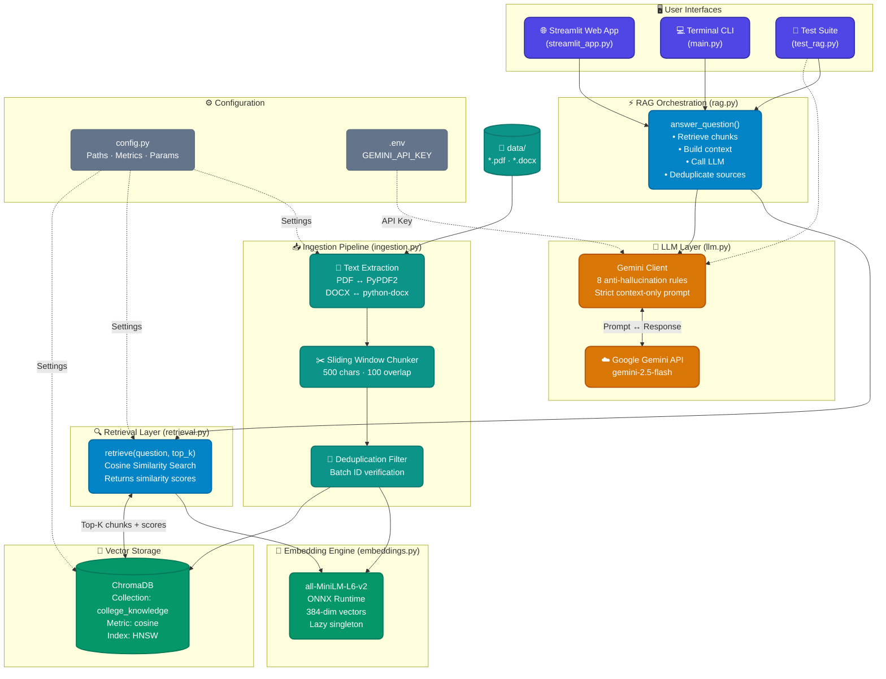
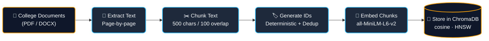
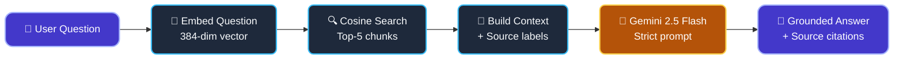

<p align="center">
  
  
  
  
  
</p>

<h1 align="center">🎓 CampusAI — College RAG Chatbot</h1>

<p align="center">
  <em>An intelligent, context-grounded <strong>Retrieval-Augmented Generation</strong> assistant that answers student and faculty questions <strong>strictly</strong> from your college documents — no hallucinations, no guesswork.</em>
</p>

<p align="center">
  <strong>Google Gemini 2.5 Flash</strong> · <strong>ChromaDB (Cosine Similarity)</strong> · <strong>all-MiniLM-L6-v2 (ONNX)</strong> · <strong>Streamlit</strong>
</p>

---

## 📑 Table of Contents

- [Quick Start (TL;DR)](#-quick-start-tldr)
- [Overview & Key Features](#-overview--key-features)
- [Technology Stack](#-technology-stack)
- [System Architecture](#-system-architecture)
- [How It Works — End-to-End Flow](#-how-it-works--end-to-end-flow)
- [Project Structure](#-project-structure)
- [Module Deep Dive](#-module-deep-dive)
- [Prerequisites](#-prerequisites)
- [Installation & Setup](#-installation--setup)
- [Usage Guide](#-usage-guide)
  - [1. Document Ingestion](#1-document-ingestion)
  - [2. Streamlit Web UI](#2-streamlit-web-ui)
  - [3. Terminal CLI](#3-terminal-cli)
  - [4. Pipeline Tests](#4-pipeline-tests)
- [Example Questions You Can Ask](#-example-questions-you-can-ask)
- [Technical Deep Dive](#-technical-deep-dive)
  - [Cosine Similarity in Detail](#cosine-similarity-in-detail)
  - [Chunking Strategy & Overlap](#chunking-strategy--overlap)
  - [Anti-Hallucination Prompt Engineering](#anti-hallucination-prompt-engineering)
- [API Response Format](#-api-response-format)
- [Configuration Reference](#-configuration-reference)
- [Troubleshooting & FAQ](#-troubleshooting--faq)
- [Contributing](#-contributing)
- [License](#-license)

---

## ⚡ Quick Start (TL;DR)

```bash
# 1. Install dependencies
pip install -r requirements.txt

# 2. Set your API key
echo GEMINI_API_KEY=your_key_here > .env

# 3. Drop PDFs/DOCX files into the data/ folder, then index them
python ingestion.py

# 4. Launch the web chatbot
streamlit run streamlit_app.py
```

Open `http://localhost:8501` and start asking questions! 🚀

---

## 🌟 Overview & Key Features

| Feature | Description |
| :--- | :--- |
| 🔒 **Strict Document Grounding** | The LLM answers **only** from retrieved document chunks — never from its own training data. If the answer isn't in the documents, it says so explicitly. |
| 📐 **Cosine Similarity Search** | ChromaDB's HNSW vector index is configured with `hnsw:space: cosine` for mathematically precise semantic matching between queries and document chunks. |
| 🧠 **Lightweight Embeddings** | Uses `all-MiniLM-L6-v2` via ONNX Runtime (ChromaDB's `DefaultEmbeddingFunction`) — no heavy PyTorch or TensorFlow required. Produces 384-dimensional vectors. |
| 📄 **Multi-Format Ingestion** | Reads **PDF** files page-by-page (via `PyPDF2`) and **DOCX** files paragraph-by-paragraph (via `python-docx`), handling both seamlessly. |
| 🔁 **Idempotent Indexing** | Deterministic chunk IDs (`{source}__page{N}__chunk{M}`) ensure re-running ingestion **never creates duplicates**. |
| 📎 **Source Citations** | Every answer comes with traceable source tags showing the exact document filename and page number. |
| 🌙 **Premium Dark-Mode UI** | Streamlit web interface with glassmorphism design, animated status indicators, Inter typography, and conversation memory. |
| 💻 **Dual Interface** | Choose between the rich **Streamlit web app** or a minimal **terminal CLI** for quick queries. |

---

## 🛠️ Technology Stack

| Layer | Technology | Role |
| :--- | :--- | :--- |
| **LLM** | Google Gemini 2.5 Flash | Grounded answer generation with strict anti-hallucination prompting |
| **Vector Database** | ChromaDB (Persistent) | HNSW-indexed vector storage with cosine similarity metric |
| **Embedding Model** | `all-MiniLM-L6-v2` (ONNX) | Converts text → 384-dimensional dense vectors |
| **PDF Parser** | PyPDF2 | Page-by-page text extraction from PDF documents |
| **DOCX Parser** | python-docx | Paragraph-level text extraction from Word documents |
| **Web Framework** | Streamlit | Interactive chat UI with session state and caching |
| **Config Management** | python-dotenv | Secure API key loading from `.env` files |
| **Language** | Python 3.10+ | Core application logic |

---

## 🏗️ System Architecture



---

## 🔄 How It Works — End-to-End Flow

### Ingestion (Offline — Run Once per Document Update)



### Query (Real-time — Every User Question)



### Full Sequence Diagram

```mermaid
sequenceDiagram
    autonumber
    actor User
    participant UI as 🖥️ Streamlit / CLI
    participant RAG as ⚡ rag.py
    participant RET as 🔍 retrieval.py
    participant EMB as 🔢 embeddings.py
    participant DB as 💾 ChromaDB
    participant LLM as 🤖 llm.py
    participant API as ☁️ Gemini API

    User->>UI: "What are the library timings?"
    UI->>RAG: answer_question(question)

    rect rgb(30, 41, 59)
        Note over RAG,DB: 🔍 Retrieval Phase (Cosine Similarity)
        RAG->>RET: retrieve(question, top_k=5)
        RET->>EMB: get_embedding(question)
        EMB-->>RET: [384-dimensional float vector]
        RET->>DB: collection.query(embedding, n=5)
        DB-->>RET: Top-5 chunks + distances
        RET->>RET: similarity = 1.0 - distance
        RET-->>RAG: [{text, source, page, similarity}, ...]
    end

    rect rgb(55, 48, 28)
        Note over RAG,API: 🤖 Generation Phase (Grounded)
        RAG->>RAG: format_context(chunks)
        RAG->>LLM: generate_answer(context, question)
        LLM->>LLM: Build strict 8-rule prompt
        LLM->>API: gemini-2.5-flash(prompt)
        API-->>LLM: Generated answer
        LLM-->>RAG: Answer text
    end

    RAG->>RAG: format_sources(chunks)
    RAG-->>UI: {answer, sources, chunks_used, chunks}
    UI-->>User: Answer + 📄 Source badges
```



---

## 📂 Project Structure

```text
College_chatbot/
│
├── 📁 data/                            # ← Drop your college documents here
│   └── campusai_college_knowledge_base_50_pages.docx
│
├── 📁 chroma_db/                       # Auto-generated persistent vector database
│
├── ⚙️  config.py                       # Central configuration (paths, metrics, params)
├── 🔢 embeddings.py                    # Embedding engine (all-MiniLM-L6-v2 ONNX singleton)
├── 📥 ingestion.py                     # Document extraction, chunking & indexing pipeline
├── 🔍 retrieval.py                     # Cosine similarity search against ChromaDB
├── 🤖 llm.py                           # Google Gemini client + anti-hallucination prompt
├── ⚡ rag.py                           # RAG pipeline orchestrator (ties everything together)
├── 🌐 streamlit_app.py                 # Premium dark-mode web chat interface
├── 💻 main.py                          # Interactive terminal CLI
├── 🧪 test_rag.py                      # End-to-end pipeline validation tests
│
├── 📦 requirements.txt                 # Python dependencies
├── 🔑 .env                             # Environment variables (GEMINI_API_KEY)
├── 🚫 .gitignore                       # Git exclusion rules
└── 📖 README.md                        # This file
```

---

## 🔎 Module Deep Dive

### `config.py` — Central Configuration
The single source of truth for all pipeline parameters. Every other module imports from here, so you can tune the entire system without touching any pipeline code.

### `embeddings.py` — Embedding Engine
Wraps ChromaDB's `DefaultEmbeddingFunction` (which uses `all-MiniLM-L6-v2` via ONNX Runtime) as a **lazy-loaded singleton**. This means:
- The model loads only on first use, not at import time.
- Streamlit reruns don't reload the model.
- Both ingestion and retrieval share the **exact same** vector space.

### `ingestion.py` — Document Ingestion Pipeline
A 3-stage pipeline:

| Stage | Function | What It Does |
| :--- | :--- | :--- |
| **1. Extract** | `extract_text_from_pdf()` / `extract_text_from_docx()` | Reads documents format-specifically. PDFs are page-by-page; DOCX groups 20 paragraphs into logical pages. |
| **2. Chunk** | `chunk_text()` + `create_chunks_from_pages()` | Sliding window splits text into 500-char chunks with 100-char overlap. Each chunk gets a deterministic ID. |
| **3. Store** | `store_chunks_in_chromadb()` | Batch-checks ChromaDB for existing IDs (batches of 500), embeds only new chunks, inserts in batches of 5000. |

### `retrieval.py` — Cosine Similarity Retrieval
Connects to the `college_knowledge` collection with `hnsw:space: cosine`. For each query:
1. Embeds the question into a 384-dim vector.
2. Queries ChromaDB for the top-K nearest neighbors.
3. Converts cosine distances into similarity scores: `similarity = 1.0 - distance`.
4. Returns enriched chunk objects with both `distance` and `similarity` fields.

### `llm.py` — LLM Integration & Guardrails
- Validates the `GEMINI_API_KEY` before every call (graceful error if missing).
- Constructs a meticulously engineered prompt with **8 strict anti-hallucination rules**.
- Calls `gemini-2.5-flash` via the `google-genai` SDK.
- Returns plain text answers or descriptive error messages.

### `rag.py` — RAG Orchestrator
The glue module that coordinates the entire pipeline in 4 steps:
1. **Retrieve** — Calls `retrieval.py` to get the top-K chunks.
2. **Format** — Builds a labeled context string with source/page headers per chunk.
3. **Generate** — Sends context + question to `llm.py`.
4. **Attribute** — Deduplicates source references and packages the final response.

### `streamlit_app.py` — Web Chat Interface
A production-ready Streamlit app featuring:
- **`@st.cache_resource`** for one-time RAG pipeline loading.
- Custom CSS with Inter font, glassmorphism hero banner, animated status pill, and styled source badges.
- Session-based conversation history that persists across reruns.
- Sidebar with architecture info and a "Clear Conversation" button.

### `main.py` — Terminal CLI
A simple REPL loop: prompt → retrieve → generate → display answer + sources. Type `quit`, `exit`, or `q` to stop.

---

## ⚙️ Prerequisites

| Requirement | Details |
| :--- | :--- |
| **Python** | 3.10 or higher (tested on 3.10 – 3.12) |
| **Gemini API Key** | Free tier available at [Google AI Studio](https://aistudio.google.com/) |
| **Disk Space** | ~200 MB for dependencies + ChromaDB index |
| **OS** | Windows, macOS, or Linux |

---

## 🚀 Installation & Setup

### 1. Clone the Repository
```bash
git clone https://github.com/your-username/College_chatbot.git
cd College_chatbot
```

### 2. Create a Virtual Environment
```bash
# Windows
python -m venv venv
venv\Scripts\activate

# macOS / Linux
python3 -m venv venv
source venv/bin/activate
```

### 3. Install Dependencies
```bash
pip install -r requirements.txt
```

**Dependencies installed:**
| Package | Purpose |
| :--- | :--- |
| `google-genai` | Google Gemini API client |
| `python-dotenv` | Load `.env` environment variables |
| `chromadb` | Persistent vector database with ONNX embeddings |
| `PyPDF2` | PDF text extraction |
| `python-docx` | DOCX text extraction |
| `streamlit` | Web application framework |

### 4. Configure Your API Key

Create a `.env` file in the project root:

```ini
GEMINI_API_KEY=your_actual_gemini_api_key_here
```

> ⚠️ **Important:** Do not wrap the key in quotes. Do not add spaces around the `=` sign.

### 5. Add Your Documents

Place your college PDF and/or DOCX files into the `data/` directory:

```text
data/
├── academic_regulations.pdf
├── admission_handbook.pdf
├── campus_facilities_guide.docx
└── student_code_of_conduct.pdf
```

---

## 📖 Usage Guide

### 1. Document Ingestion

Index your documents into the ChromaDB vector store:

```bash
python ingestion.py
```

**Expected Output:**
```
============================================================
  College Chatbot — Document Ingestion
============================================================
[ingestion] Reading: campusai_college_knowledge_base_50_pages.docx
[ingestion] Extracted 17 non-empty pages from 1 document(s).
[ingestion] Created 92 chunks from 17 pages.
[ingestion] 0 chunks already exist, 92 new chunks to add.
[ingestion] Generating embeddings for 92 chunks...
[ingestion] Successfully stored 92 new chunks in ChromaDB.

[ingestion] Done! Your documents are now indexed and ready for retrieval.
[ingestion] ChromaDB location: D:\projects\College_chatbot\chroma_db
```

> 💡 **Tip:** Running ingestion again after adding new documents will only index the **new** chunks — existing ones are automatically skipped.

---

### 2. Streamlit Web UI

```bash
streamlit run streamlit_app.py
```

Open `http://localhost:8501` in your browser.

**Web UI Features:**
- 🎨 Dark glassmorphism theme with gradient hero banner
- 💬 Real-time chat bubbles with conversation memory
- 📄 Inline source citation badges (e.g., `📄 handbook.pdf, p.12`)
- 🟢 Live "Knowledge base connected" status indicator
- 🗑️ One-click conversation reset in sidebar
- ⚡ Cached pipeline loading (instant after first load)

---

### 3. Terminal CLI

```bash
python main.py
```

**Example Session:**
```
============================================================
  College Chatbot (RAG)
============================================================

Ask questions about your college documents.
Type 'quit' or 'exit' to stop.

Enter your question:
> What are the library timings?

Searching documents and generating answer...

----------------------------------------
Answer:
According to the college documents, the library is open from
8:00 AM to 8:00 PM on weekdays and from 9:00 AM to 5:00 PM
on Saturdays.

Sources:
  • campusai_college_knowledge_base_50_pages.docx, page 16
  • campusai_college_knowledge_base_50_pages.docx, page 2

(Used 5 document chunks)
----------------------------------------
```

---

### 4. Pipeline Tests

Validate both the direct LLM connection and full RAG flow:

```bash
python test_rag.py
```

- **Test 1:** Direct Gemini API call with a controlled context → verifies API key and connectivity.
- **Test 2:** Full end-to-end RAG pipeline → verifies ingestion, retrieval, context building, and generation.

---

## 💬 Example Questions You Can Ask

These are examples of questions that CampusAI is designed to handle (actual answers depend on your indexed documents):

| Category | Example Questions |
| :--- | :--- |
| 📚 **Academics** | "What is the minimum attendance requirement?" · "What is the GPA grading scale?" · "How does the credit system work?" |
| 🎓 **Admissions** | "What are the eligibility criteria for admission?" · "What is the fee structure?" · "When is the admission deadline?" |
| 🏛️ **Facilities** | "What are the library timings?" · "Does the campus have a gymnasium?" · "Where is the computer lab located?" |
| 📋 **Policies** | "What is the anti-ragging policy?" · "What is the dress code?" · "What are the exam rules?" |
| 👥 **Campus Life** | "What student clubs are available?" · "What sports facilities exist?" · "How does the hostel allotment work?" |
| 📞 **Administration** | "Who is the head of department?" · "What are the office hours?" · "How do I apply for a transfer certificate?" |

---

## 🔬 Technical Deep Dive

### Cosine Similarity in Detail

The retrieval engine uses **cosine similarity** to measure semantic relevance between the user's question and stored document chunks.

**How it works:**

```
                    A · B
Cosine Similarity = ─────────
                    ‖A‖ × ‖B‖
```

Where `A` is the question embedding vector and `B` is a document chunk embedding vector (both 384-dimensional).

**In ChromaDB's implementation:**
- The `hnsw:space` metadata is set to `"cosine"`.
- ChromaDB returns a **cosine distance** = `1.0 - cosine_similarity`.
- Our retrieval code converts it back:

```python
similarity = round(1.0 - distance, 4)
```

| Score | Meaning |
| :--- | :--- |
| `similarity ≈ 1.0` | Nearly identical semantic content |
| `similarity ≈ 0.5` | Moderately related |
| `similarity ≈ 0.0` | Completely unrelated (orthogonal) |

**Why cosine over L2 (Euclidean)?**
Cosine similarity measures the *angle* between vectors, not the *magnitude*. This makes it robust to variations in text length — a short question and a long paragraph can still have high similarity if they discuss the same topic.

---

### Chunking Strategy & Overlap

Documents are split using a **sliding window** approach:

```
Document text: "ABCDEFGHIJKLMNOPQRSTUVWXYZ..."

Chunk 1: |████████████████████|          (chars 0–499)
Chunk 2:             |████████████████████|  (chars 400–899)
                     ↑                    
              100-char overlap zone
```

| Parameter | Value | Rationale |
| :--- | :--- | :--- |
| `CHUNK_SIZE` | 500 chars | Balances between enough context per chunk and vector precision. |
| `CHUNK_OVERLAP` | 100 chars | Ensures sentences or ideas that span chunk boundaries appear in both adjacent chunks. |
| `Step size` | 400 chars | `CHUNK_SIZE - CHUNK_OVERLAP` = how far the window slides. |

**Deterministic chunk IDs** prevent duplicates:
```
campusai_college_knowledge_base_50_pages.docx__page3__chunk2
└─────────────── source ──────────────────┘  └page┘ └chunk┘
```

---

### Anti-Hallucination Prompt Engineering

The system prompt in `llm.py` enforces **8 strict rules** on the Gemini model:

| # | Rule | Purpose |
| :--- | :--- | :--- |
| 1 | Use **ONLY** explicitly stated Context information | Prevents reliance on training data |
| 2 | Do **NOT** infer, assume, guess, or extrapolate | Eliminates speculation |
| 3 | Do **NOT** add opinions or commentary | Keeps responses objective |
| 4 | Do **NOT** paraphrase in meaning-changing ways | Preserves original intent |
| 5 | If info is missing, use exact fallback phrase | Deterministic "I don't know" response |
| 6 | Do **NOT** hallucinate facts, names, dates, or numbers | Core safety guardrail |
| 7 | Reference the source document when answering | Enables traceability |
| 8 | Respond casually to greetings; redirect if stuck | User-friendly fallback behavior |

**Standard fallback response when information is not found:**

> *"I could not find this information in the available college documents. Please contact the college administration for assistance."*

---

## 📦 API Response Format

The `answer_question()` function in `rag.py` returns a structured dictionary:

```python
{
    "answer": "According to the college documents, the library is open from 8:00 AM to 8:00 PM on weekdays...",

    "sources": [
        {"source": "campus_handbook.pdf", "page": 16},
        {"source": "campus_handbook.pdf", "page": 2}
    ],

    "chunks_used": 5,

    "chunks": [
        {
            "text": "The central library operates from 8:00 AM to 8:00 PM...",
            "source": "campus_handbook.pdf",
            "page": 16,
            "chunk_index": 0,
            "distance": 0.5396,            # Cosine distance (lower = more similar)
            "similarity": 0.4604,           # Cosine similarity (higher = more similar)
            "cosine_similarity": 0.4604     # Alias for similarity
        },
        ...
    ]
}
```

| Field | Type | Description |
| :--- | :--- | :--- |
| `answer` | `str` | The LLM-generated, context-grounded response |
| `sources` | `list[dict]` | Deduplicated list of `{source, page}` references |
| `chunks_used` | `int` | Number of document chunks used as context |
| `chunks` | `list[dict]` | Full retrieved chunks with text, metadata, and similarity scores |

---

## 🔧 Configuration Reference

All tunable parameters live in `config.py`:

| Variable | Default | Description |
| :--- | :---: | :--- |
| `DATA_DIR` | `data/` | Directory containing raw college PDF / DOCX documents |
| `CHROMA_DB_DIR` | `chroma_db/` | Persistent ChromaDB storage directory |
| `COLLECTION_NAME` | `"college_knowledge"` | Name of the ChromaDB collection |
| `DISTANCE_METRIC` | `"cosine"` | Vector similarity metric (`cosine`, `l2`, or `ip`) |
| `CHUNK_SIZE` | `500` | Maximum characters per text chunk |
| `CHUNK_OVERLAP` | `100` | Overlapping characters between consecutive chunks |
| `TOP_K` | `5` | Number of most relevant chunks retrieved per query |

**Environment Variables** (in `.env`):

| Variable | Required | Description |
| :--- | :---: | :--- |
| `GEMINI_API_KEY` | ✅ Yes | Google Gemini API key from [AI Studio](https://aistudio.google.com/) |

---

## ❓ Troubleshooting & FAQ

<details>
<summary><strong>⚠️ "GEMINI_API_KEY is not configured or invalid"</strong></summary>

- Verify your `.env` file exists in the project root directory.
- Ensure it contains `GEMINI_API_KEY=AIzaSy...` (no quotes, no spaces).
- Confirm the key is active at [Google AI Studio](https://aistudio.google.com/).

</details>

<details>
<summary><strong>⚠️ "ChromaDB collection is empty. Run ingestion.py first."</strong></summary>

- Place at least one `.pdf` or `.docx` file in the `data/` folder.
- Run `python ingestion.py` to index the documents.

</details>

<details>
<summary><strong>🔄 How do I re-index the entire knowledge base from scratch?</strong></summary>

Delete the existing index and re-ingest:
```bash
# Option 1: Delete the directory manually
rmdir /s /q chroma_db     # Windows
rm -rf chroma_db           # macOS / Linux

# Then re-run ingestion
python ingestion.py
```

Or programmatically:
```bash
python -c "import chromadb; from config import *; c = chromadb.PersistentClient(path=CHROMA_DB_DIR); c.delete_collection(COLLECTION_NAME); print('Deleted'); from ingestion import ingest; ingest()"
```

</details>

<details>
<summary><strong>📄 How do I add more documents without re-indexing everything?</strong></summary>

Simply drop new `.pdf` or `.docx` files into `data/` and run:
```bash
python ingestion.py
```
The pipeline automatically detects which chunks are already indexed and only processes new ones.

</details>

<details>
<summary><strong>🔧 How do I change the number of chunks retrieved?</strong></summary>

Edit `TOP_K` in `config.py`:
```python
TOP_K = 10  # Retrieve 10 chunks instead of 5
```
Higher values provide more context but may include less relevant chunks.

</details>

<details>
<summary><strong>🔧 How do I change the chunk size or overlap?</strong></summary>

Edit `config.py`:
```python
CHUNK_SIZE = 1000    # Larger chunks = more context per chunk
CHUNK_OVERLAP = 200  # More overlap = better boundary coverage
```
> ⚠️ After changing chunk parameters, you must **re-index** (delete `chroma_db/` and re-run `python ingestion.py`).

</details>

<details>
<summary><strong>🌐 How do I change the Streamlit port?</strong></summary>

```bash
streamlit run streamlit_app.py --server.port 8080
```

</details>

---

## 🤝 Contributing

Contributions are welcome! Here's how to get started:

1. **Fork** the repository
2. **Create** a feature branch: `git checkout -b feature/my-feature`
3. **Commit** your changes: `git commit -m "Add my feature"`
4. **Push** to the branch: `git push origin feature/my-feature`
5. **Open** a Pull Request

### Ideas for Contribution
- 🖼️ Support for image-based PDFs (OCR integration)
- 🌍 Multi-language document support
- 📊 Analytics dashboard for query patterns
- 🔐 User authentication for the web UI
- 📱 Mobile-responsive design improvements
- 🧪 Expanded test coverage

---

## 📄 License

This project is open-source. Feel free to use, modify, and distribute it for educational and institutional purposes.

---

<p align="center">
  <strong>Built using Streamlit · ChromaDB · Google Gemini</strong>
</p>
